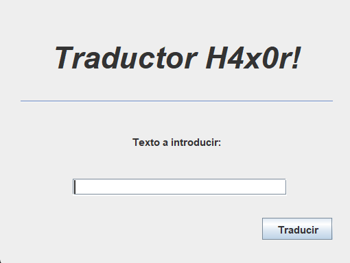

# *Traductor hacker*

---

Este mini programa es una adaptación de "EL LENGUAJE HACKER" de .

## Tecnologías usuadas

---

## Descripción

---

Este programa que ha sido creado con Java Swing, se trata de 
de una interfaz con el que se introduce un texto y lo traduce
a , un lenguaje 
que se utiliza en la cultura hacker.

### Desarollado por: **_Alejandro Lucena_** 👨🏻‍💻🐧